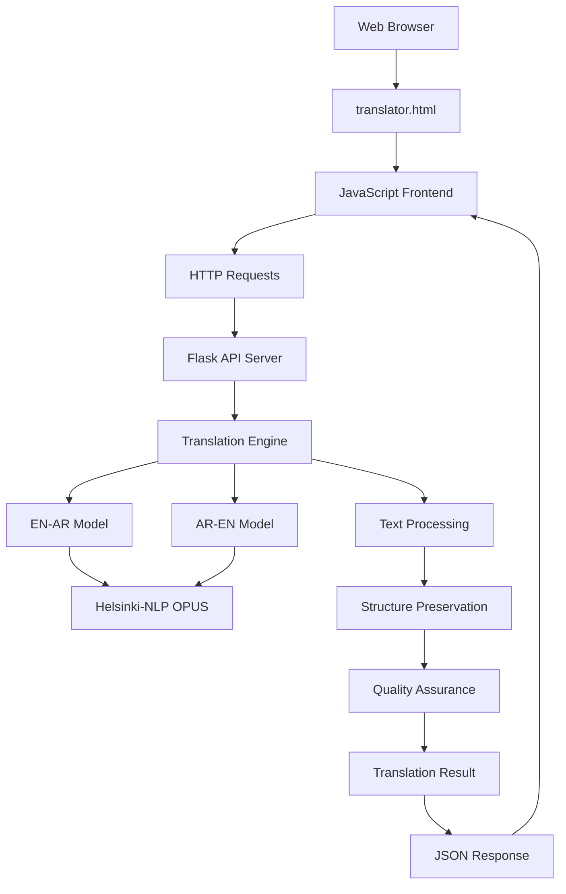
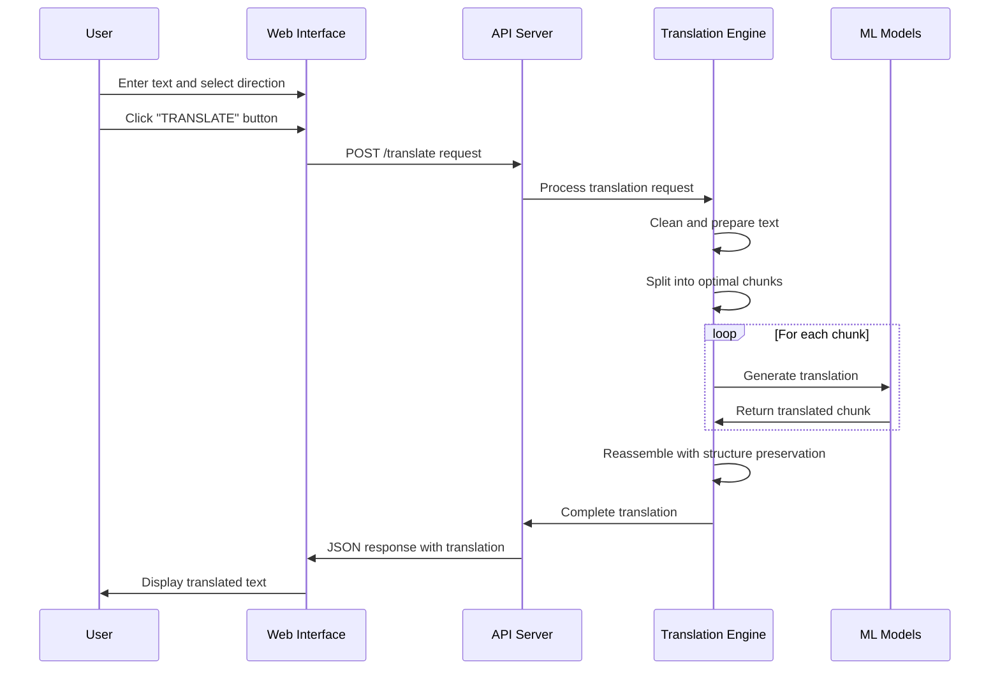

# xsukax EN-AR Offline Translator

[](https://www.gnu.org/licenses/gpl-3.0)
[](https://www.python.org/downloads/)
[](https://flask.palletsprojects.com/)

A professional-grade offline English-Arabic translator that operates entirely on your local machine without requiring internet connectivity. Built with privacy-first principles and powered by Helsinki-NLP's OPUS machine translation models.

## Project Overview

xsukax EN-AR Offline Translator is a comprehensive translation solution designed for users who require high-quality English-Arabic translation capabilities while maintaining complete data privacy and security. The application combines a robust Python backend API with an intuitive web-based frontend, delivering professional translation results without ever transmitting your text to external servers.

The system supports bidirectional translation (English ↔ Arabic) and is specifically optimized for:
- **Complete offline operation** - No internet required after initial setup
- **Structure preservation** - Maintains paragraph formatting and text organization
- **Quality assurance** - Advanced chunking algorithms prevent mixed-language outputs
- **Professional interface** - Clean, responsive web UI with dark/light themes
- **Privacy protection** - All processing occurs locally on your machine

## Security and Privacy Benefits

### Complete Data Isolation
- **Zero external communication**: Once installed, the application operates entirely offline
- **Local processing only**: All translation occurs on your machine using locally stored models
- **No telemetry or tracking**: The application does not collect, store, or transmit any usage data
- **No cloud dependencies**: Independence from third-party translation services

### Data Protection Features
- **In-memory processing**: Input text is processed in memory and not permanently stored
- **Secure local storage**: Translation models are stored locally under your user directory
- **No logging of sensitive data**: Only technical logging for debugging purposes
- **Session-based operation**: No persistent storage of user translations

### Network Security
- **Localhost-only API**: Backend API binds exclusively to localhost (127.0.0.1)
- **CORS protection**: Configured Cross-Origin Resource Sharing for web interface security
- **No external API calls**: Zero risk of data interception during translation requests

## Features and Advantages

### Core Translation Capabilities
- **Bidirectional translation**: Full support for English → Arabic and Arabic → English
- **Advanced text processing**: Intelligent paragraph detection and sentence segmentation
- **Structure preservation**: Maintains original formatting, line breaks, and paragraph spacing
- **Quality optimization**: Multi-beam search and length penalties for improved translation quality

### User Experience
- **Professional web interface**: Modern, responsive design with accessibility features
- **Dual theme support**: Dark and light themes for comfortable usage
- **Real-time feedback**: Live character counting, structure analysis, and quality indicators
- **Copy functionality**: One-click copying of source text and translations
- **Language swap**: Quick reversal of translation direction with content preservation

### Technical Excellence
- **Robust error handling**: Comprehensive error detection and user-friendly error messages
- **Smart text chunking**: Advanced algorithms handle long texts while preventing mixed-language outputs
- **Performance optimization**: Efficient model loading and memory management
- **Health monitoring**: Built-in API health checks and status reporting

### Unique Advantages
- **No subscription fees**: Complete functionality without ongoing costs
- **No usage limits**: Translate unlimited text without restrictions
- **No internet dependency**: Works in air-gapped environments
- **Professional quality**: Leverages state-of-the-art neural machine translation models

## Installation Instructions

### System Requirements
- **Operating System**: Windows 10+, macOS 10.15+, or Linux (Ubuntu 18.04+ recommended)
- **Python**: Version 3.7 or higher
- **Memory**: Minimum 4GB RAM (8GB recommended for optimal performance)
- **Storage**: Approximately 2GB free space for models and dependencies
- **Internet**: Required only for initial model download

### Step-by-Step Installation

#### 1. Clone or Download the Repository
```bash
git clone https://github.com/xsukax/xsukax-EN-AR-Offline-Translator.git
cd xsukax-EN-AR-Offline-Translator
```

#### 2. Run the Automated Installation
The application includes an automated installation script that handles all dependencies and model downloads:

```bash
python install_deps.py
```

This script will:
- Install all required Python packages (Flask, Transformers, PyTorch, etc.)
- Download Helsinki-NLP OPUS translation models for both directions
- Set up NLTK data for advanced text processing
- Create the necessary directory structure

#### 3. Verify Installation
The installation script will display success messages for each component. Look for:
- ✓ All packages installed successfully
- ✓ English to Arabic model downloaded and saved
- ✓ Arabic to English model downloaded and saved
- ✓ NLTK punkt tokenizer downloaded

### Manual Installation (Alternative)
If you prefer manual installation or encounter issues with the automated script:

```bash
# Install Python dependencies
pip install flask flask-cors transformers torch sentencepiece sacremoses nltk

# Download NLTK data
python -c "import nltk; nltk.download('punkt')"

# Models will be downloaded on first API startup
```

## Usage Guide

### Quick Start

#### 1. Start the Translation API Server
```bash
python translator_api.py
```

Expected output:
```
🌐 Starting xsukax EN-AR Offline Translator API Server v2.2...
🔧 Fixed version - No mixed languages, complete translation, proper formatting
✓ English to Arabic model loaded
✓ Arabic to English model loaded
🎉 All models loaded successfully!
🚀 Server starting...
📡 API will be available at: http://localhost:5000
```

#### 2. Open the Web Interface
Open `translator.html` in your web browser. The interface will automatically connect to the local API server.

#### 3. Start Translating
1. Select translation direction (EN→AR or AR→EN)
2. Enter your text in the source text area
3. Click the "TRANSLATE" button
4. View results in the translation output area

### Application Architecture



### Translation Workflow



### Advanced Usage

#### API Endpoints
The local API server provides several endpoints for integration:

- **`GET /`**: API status and information
- **`POST /translate`**: Main translation endpoint
- **`GET /health`**: Health check and model status
- **`GET /status`**: Detailed service information

#### Translation API Request Format
```json
{
    "text": "Your text to translate",
    "direction": "en-ar"
}
```

#### Translation API Response Format
```json
{
    "original_text": "Input text",
    "translated_text": "Translation result",
    "direction": "en-ar",
    "success": true,
    "paragraphs_processed": 2,
    "chunks_processed": 3,
    "formatting_preserved": true,
    "complete_translation": true,
    "mixed_languages": false
}
```

### Configuration Options

#### Text Processing Limits
- **Maximum text length**: 5,000 characters per request
- **Optimal chunk size**: 300 characters for quality balance
- **Supported formats**: Plain text with paragraph preservation

#### Performance Tuning
The translation engine uses optimized parameters:
- **Beam search**: 5 beams for quality optimization
- **Length penalty**: 1.2 for appropriate translation length
- **Repetition penalty**: 1.1 to reduce redundancy

### Troubleshooting

#### Common Issues and Solutions

**API Server Won't Start**
- Verify all dependencies are installed: `pip list | grep -E "(flask|transformers|torch)"`
- Check if models directory exists and contains downloaded models
- Ensure Python version compatibility (3.7+)

**Translation Quality Issues**
- For long texts, ensure proper paragraph breaks (double newlines)
- Avoid mixed-language input for optimal results
- Keep individual sentences under 300 characters when possible

**Web Interface Connection Problems**
- Verify API server is running on `http://localhost:5000`
- Check browser console for JavaScript errors
- Ensure firewall allows localhost connections

**Model Loading Failures**
- Re-run `install_deps.py` to re-download models
- Check available disk space (models require ~1.5GB)
- Verify stable internet connection during initial setup

## Licensing Information

This project is licensed under the **GNU General Public License v3.0 (GPL-3.0)**.

### What This License Means

**For Users:**
- **Freedom to use**: You can use this software for any purpose, including commercial use
- **Freedom to study**: You have access to the source code and can examine how it works
- **Freedom to modify**: You can modify the software to suit your needs
- **Freedom to distribute**: You can share the software and your modifications with others

**For Contributors:**
- **Copyleft protection**: Any modifications or derivative works must also be licensed under GPL-3.0
- **Source code availability**: If you distribute the software, you must make the source code available
- **Same license terms**: Any derivative works must use the same GPL-3.0 license terms

**Key Requirements:**
- Include the original license and copyright notices
- State any significant changes made to the original code
- Provide source code when distributing the software
- Use the same GPL-3.0 license for any derivative works

### Third-Party Components
This project incorporates the following open-source components:
- **Helsinki-NLP OPUS Models**: Used under their respective open licenses
- **Flask Framework**: BSD-3-Clause License
- **Transformers Library**: Apache License 2.0
- **PyTorch**: BSD-style License

The full text of the GPL-3.0 license is available in the `LICENSE` file included with this distribution or at [https://www.gnu.org/licenses/gpl-3.0.html](https://www.gnu.org/licenses/gpl-3.0.html).

---

**Developed with privacy, security, and user freedom in mind.**
